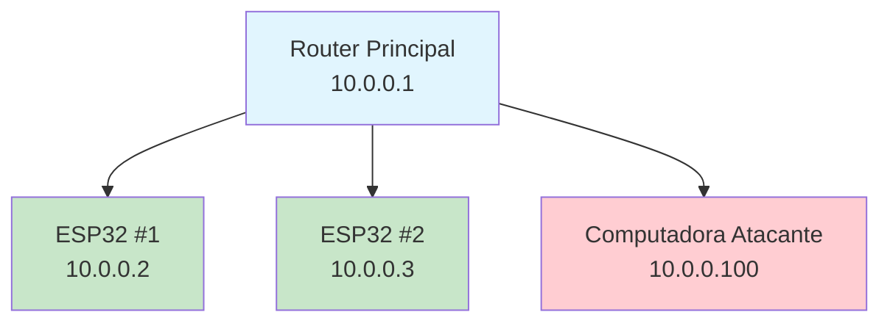

# 🛡️ Taller de Seguridad IoT

Taller práctico y educativo sobre seguridad en dispositivos IoT que demuestra el ciclo completo de seguridad, desde el reconocimiento hasta la protección, utilizando Python como herramienta principal.

## 📋 Descripción

Este taller proporciona una experiencia práctica completa sobre seguridad IoT, cubriendo tanto aspectos ofensivos como defensivos. Los participantes aprenderán técnicas de reconocimiento, explotación de vulnerabilidades, y medidas de protección para dispositivos IoT.

### Objetivos del Taller

- Demostrar vulnerabilidades comunes en dispositivos IoT
- Enseñar técnicas de reconocimiento y explotación
- Mostrar el impacto de configuraciones inseguras
- Proporcionar herramientas defensivas prácticas
- Crear conciencia sobre mejores prácticas de seguridad IoT

## 🏗️ Estructura del Proyecto

```
Material para Taller/
├── README.md                          # Este archivo
├── Manual Técnico                    # Documentación técnica completa
├── Comandos a Utilizar.txt          # Guía de comandos para Kali Linux
├── Listado de actividad.txt         # Plan de trabajo del taller
│
├── Codigos Python/                   # Scripts Python del taller
│   ├── 1-network_scanner.py         # Escáner de red para dispositivos IoT
│   ├── 2-real_dictionary_attack.py  # Ataque de fuerza bruta con diccionario
│   ├── 3-iot_analyzer.py            # Analizador de vulnerabilidades IoT
│   ├── 4-botnet_demo.py             # Simulador de botnet coordinada
│   ├── 5-botnet_web_controller.py  # Panel web de control de botnet
│   └── 6-security_tool.py           # Herramienta defensiva de seguridad
│
└── Codigos IoT/                      # Firmware para dispositivos ESP32
    ├── ESP32_Simulador_de_Sala/
    │   └── ESP32_Simulador_de_Sala.ino
    └── ESP32_Simulador_de_Entrada/
        └── ESP32_Simulador_de_Entrada.ino
```

## ⚙️ Requisitos

### Hardware
- 2 dispositivos ESP32 programados con el firmware proporcionado
- Router WiFi configurado (Google WiFi recomendado)
- Computadora con Kali Linux o distribución Linux compatible

### Software
- Python 3.8 o superior
- Kali Linux (recomendado) o distribución Linux con herramientas de seguridad
- Herramientas requeridas:
  - `hydra` - Para ataques de fuerza bruta
  - `nmap` - Para escaneo de red
  - `curl` - Para pruebas HTTP
  - Wordlist `rockyou.txt` - Para ataques de diccionario

### Bibliotecas Python
```bash
pip3 install requests flask scapy
```

## 🚀 Instalación

### 1. Preparar el Entorno

```bash
# Actualizar sistema
sudo apt update

# Instalar herramientas necesarias
sudo apt install -y hydra nmap curl python3 python3-pip

# Verificar wordlist rockyou.txt
ls -lh /usr/share/wordlists/rockyou.txt
# Si no existe, descomprimir:
sudo gunzip /usr/share/wordlists/rockyou.txt.gz

# Instalar bibliotecas Python
pip3 install requests flask scapy
```

### 2. Configurar Dispositivos ESP32

1. Abrir los archivos `.ino` en Arduino IDE
2. Configurar las credenciales WiFi en el código
3. Subir el firmware a cada ESP32
4. Anotar las IPs asignadas a cada dispositivo (típicamente 192.168.86.114 y 192.168.86.115)

### 3. Verificar Conectividad

```bash
# Verificar que los dispositivos estén accesibles
ping -c 4 192.168.86.114
ping -c 4 192.168.86.115

# Verificar servicios web
curl -I http://192.168.86.114/
curl -I http://192.168.86.115/
```

## 📖 Uso

### Flujo del Taller

El taller sigue un flujo pedagógico estructurado:

1. **Reconocimiento** - Escaneo de red y descubrimiento de dispositivos
2. **Explotación** - Ataques de fuerza bruta y análisis de vulnerabilidades
3. **Post-explotación** - Control de dispositivos y demostración de botnet
4. **Defensa** - Herramientas defensivas y hardening

### Ejecutar Scripts

Los scripts están diseñados para ejecutarse en orden:

```bash
# 1. Escanear la red y descubrir dispositivos IoT
python3 Codigos\ Python/1-network_scanner.py

# 2. Realizar ataques de fuerza bruta
python3 Codigos\ Python/2-real_dictionary_attack.py

# 3. Analizar vulnerabilidades
python3 Codigos\ Python/3-iot_analyzer.py

# 4. Demostrar botnet coordinada
python3 Codigos\ Python/4-botnet_demo.py

# 5. Panel web de control (en terminal separada)
python3 Codigos\ Python/5-botnet_web_controller.py
# Luego abrir http://localhost:5000 en el navegador

# 6. Herramientas defensivas
python3 Codigos\ Python/6-security_tool.py
```

### Comandos Manuales

Para comandos detallados usando herramientas como `hydra` y `nmap`, consulta el archivo `Comandos a Utilizar.txt`.

## 🔧 Scripts Disponibles

### 1. Network Scanner (`1-network_scanner.py`)
Escanea la red local para descubrir dispositivos IoT y sus servicios expuestos.

**Características:**
- Detección automática de red local
- Escaneo paralelo de puertos
- Identificación de tipos de dispositivos
- Generación de reportes JSON

### 2. Real Dictionary Attack (`2-real_dictionary_attack.py`)
Realiza ataques de fuerza bruta contra dispositivos IoT usando wordlists.

**Características:**
- Descubrimiento automático de dispositivos
- Ataques de diccionario con rockyou.txt
- Prueba de múltiples usuarios comunes
- Guardado de credenciales comprometidas

### 3. IoT Analyzer (`3-iot_analyzer.py`)
Analiza dispositivos IoT para identificar vulnerabilidades y configuraciones inseguras.

**Características:**
- Prueba de credenciales por defecto
- Escaneo de endpoints expuestos
- Prueba de controles remotos
- Detección de fugas de información
- Generación de reportes de vulnerabilidades

### 4. Botnet Demo (`4-botnet_demo.py`)
Simula una botnet coordinada utilizando dispositivos IoT comprometidos.

**Características:**
- Reclutamiento automático de bots
- Ataques DDoS coordinados
- Estadísticas en tiempo real
- Monitoreo de actividad

### 5. Botnet Web Controller (`5-botnet_web_controller.py`)
Panel web interactivo para monitorear y controlar la botnet.

**Características:**
- Interfaz web moderna
- Monitoreo en tiempo real
- Control de dispositivos
- Estadísticas visuales

### 6. Security Tool (`6-security_tool.py`)
Herramienta defensiva para proteger infraestructuras IoT.

**Características:**
- Inventario automático de dispositivos
- Análisis continuo de vulnerabilidades
- Detección de cambios en la red
- Recomendaciones de hardening

## 🎯 Dispositivos ESP32

El taller utiliza dos dispositivos ESP32 simulando diferentes funciones:

### ESP32 Simulador de Sala
- **IP típica:** 192.168.86.114
- **Credenciales por defecto:** admin:123456
- **Funciones:** Control de TV, luces, aire acondicionado, lámparas

### ESP32 Simulador de Entrada
- **IP típica:** 192.168.86.115
- **Credenciales por defecto:** user:12345
- **Funciones:** Control de puertas, sistema de alarma, garage

## ⚠️ Consideraciones de Seguridad

### Entorno Controlado
- **IMPORTANTE:** Todos los scripts están diseñados para ejecutarse exclusivamente en entornos de laboratorio controlados
- Los dispositivos deben ser de propiedad del instructor/organización
- La red debe estar aislada y no conectada a Internet

### Propósito Educativo
- Este material tiene fines exclusivamente educativos
- Se enfatiza la importancia del consentimiento y autorización
- No debe utilizarse en redes o dispositivos sin autorización explícita

### Cumplimiento Legal
- El taller debe realizarse en redes aisladas
- Todos los participantes deben estar informados del propósito educativo
- Se debe obtener autorización antes de cualquier actividad de seguridad

## 📚 Documentación Adicional

- **Manual Técnico** - Documentación técnica completa de cada script
- **Comandos a Utilizar.txt** - Guía detallada de comandos para Kali Linux
- **Listado de actividad.txt** - Plan de trabajo paso a paso del taller

## 🕒 Duración Estimada

- **Preparación:** 20 minutos
- **Reconocimiento:** 25 minutos
- **Fuerza Bruta:** 35 minutos
- **Explotación:** 30 minutos
- **Botnet:** 30 minutos
- **Defensas:** 25 minutos
- **Cierre:** 15 minutos

**Total:** ~3 horas

## 📝 Resultados de Aprendizaje

Al completar este taller, los participantes habrán:

- Comprendido vectores de ataque comunes en IoT
- Adquirido habilidades prácticas de evaluación de seguridad
- Aprendido sobre herramientas defensivas
- Desarrollado conciencia de mejores prácticas de seguridad
- Experimentado el ciclo completo de seguridad IoT

## Diagrama de Red - Proyecto IoT



## 🤝 Contribuciones

Este es un proyecto educativo. Las mejoras y sugerencias son bienvenidas, siempre manteniendo el enfoque educativo y ético.

## 📄 Licencia

Material educativo para uso en talleres y cursos de seguridad.

---

**⚠️ ADVERTENCIA:** Este material es exclusivamente para fines educativos en entornos controlados. El uso no autorizado de estas herramientas puede ser ilegal.

